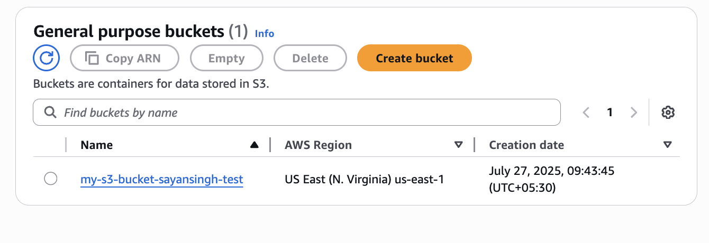
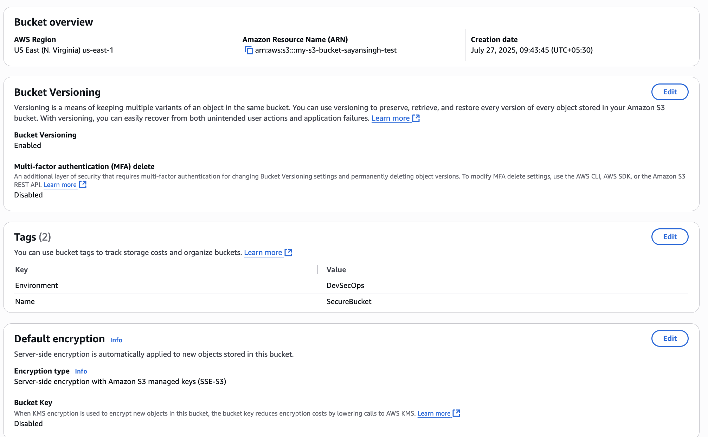
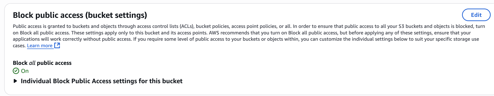
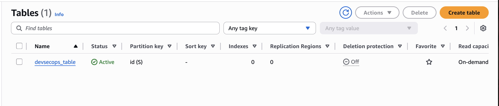
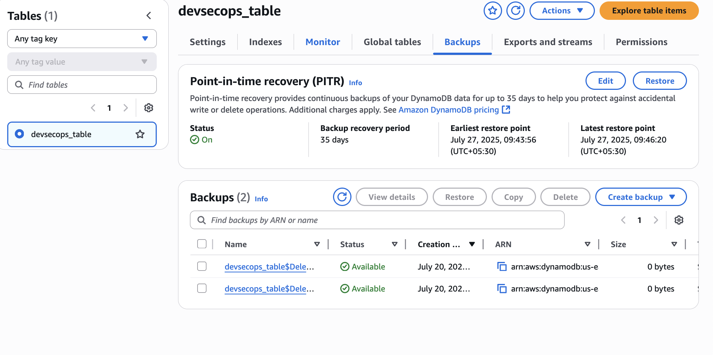

# Secure DevSecOps Infrastructure with Terraform, Docker & GitHub Actions

This project demonstrates a robust DevSecOps pipeline that automates cloud infrastructure provisioning while integrating security at every stage of the CI/CD process. It uses Terraform, Docker, and GitHub Actions to deploy secure and cost-efficient infrastructure on AWS.

## Overview

The repository automates the creation and scanning of infrastructure and containers using:

- Infrastructure linting & validation
- Cost estimation using Infracost
- Docker image vulnerability scanning with Trivy
- Secure deployment to AWS using Terraform

## Tools & Technologies

| Tool           | Purpose                                     |
|----------------|---------------------------------------------|
| Terraform      | Infrastructure as Code                      |
| TFLint         | Terraform code linting                      |
| Infracost      | Cloud cost estimation                       |
| Docker         | Containerization                            |
| Trivy          | Container vulnerability scanning            |
| GitHub Actions | CI/CD orchestration                         |
| AWS S3         | Secure object storage                       |
| AWS DynamoDB   | NoSQL database with PITR & encryption       |

## Security Implementation

Security has been a key focus across all infrastructure components and CI/CD stages:

### Infrastructure Security (IaC)

- **S3 Bucket Security:**
  - Server-side encryption with **AES-256** enabled
  - **Versioning** to maintain historical data
  - **Public access fully blocked**
  - **Lifecycle policy** to automatically delete objects after 30 days
  - **Access logging** configured for auditability

- **DynamoDB Table Security:**
  - **Server-side encryption** with AWS-managed KMS key enabled
  - **Point-in-time recovery** (PITR) enabled for data rollback
  - Tagged with environment details for better resource tracking

### Pipeline Security (CI/CD)

- **Terraform validation and linting** prevent insecure misconfigurations
- **Trivy** scans Docker images for known vulnerabilities before deployment
- **Environment secrets** (AWS credentials, DockerHub credentials, Infracost API) are stored securely using GitHub Actions Secrets
- **All deployment steps** require completion of prior security checks (via `needs:` in GitHub Actions workflow)

## Infrastructure Provisioned

The following AWS resources are deployed using Terraform:

### S3 Bucket: `my-s3-bucket-sayansingh-test`

- Versioning enabled  
- Server-side encryption (AES-256)  
- Public access blocked  
- Lifecycle rule to delete objects after 30 days  
- Access logging enabled

### DynamoDB Table: `devsecops_table`

- On-demand billing (PAY_PER_REQUEST)  
- Server-side encryption enabled  
- Point-in-time recovery (PITR) enabled  
- Environment-specific tagging

## CI/CD Workflow (.github/workflows/ci-cd.yml)

### 1. Terraform Lint & Validation (`iac-scan`)
- Validates syntax and checks for best practices

### 2. Cost Estimation (`cost-estimation`)
- Uses Infracost to estimate and visualize infrastructure costs

### 3. Docker Build & Scan (`docker-scan`)
- Builds Docker image  
- Scans for vulnerabilities using Trivy

### 4. Terraform Deployment (`deploy`)
- Applies infrastructure on AWS only after passing previous jobs

## Screenshots to Include in README or Demo

### S3 Bucket Overview  

### S3 Bucket Properties (Versioning, Encryption)  

### S3 Bucket Access Control  

### DynamoDB Table Configuration  

### DynamoDB PITR and Backups  

## Secrets Used

Ensure these secrets are configured in GitHub repository:

| Secret Name             | Purpose                        |
|-------------------------|--------------------------------|
| `AWS_ACCESS_KEY_ID`     | Terraform AWS access           |
| `AWS_SECRET_ACCESS_KEY` | Terraform AWS access           |
| `DOCKER_USERNAME`       | DockerHub login                |
| `DOCKER_PASSWORD`       | DockerHub login                |
| `INFRACOST_API_KEY`     | Infracost API authentication   |

## Cleanup Instructions

To avoid incurring cloud charges:

1. **Delete S3 Bucket:**
   - Empty its contents and then delete it via AWS Console

2. **Delete DynamoDB Table:**
   - Go to AWS DynamoDB > Tables > `devsecops_table` > Delete

## License

MIT License

## Author

**Sayan Singh**
